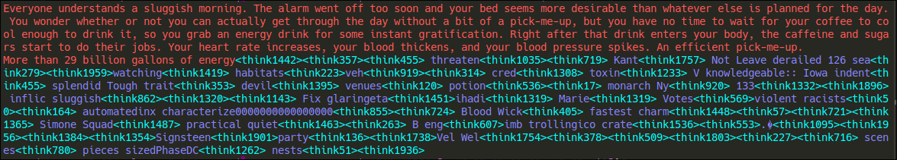

# Some clarifications
#### What exactly is meant by an 'extra token' or 'thinking token'?
- text is turned into numerical data via tokenization. token 0 may be ' a', token 6543 may be ' Christmas' and in gpt2-small, token 50257, the largest token id, is '<endoftext>', a special token for the end of a sequence.
- By 'adding extra tokens', I mean I expand the d_vocab of the model, making the embedding and unembedding layers larger, adding extra rows.
- Now there are larger token id's that the model can take as input and produce as output.
- But these new token ids will never be seen in any pretraining dataset, becuase they don't correspond to text. So what is the meaining of these tokens?
    - They have no textual association. They don't correspond to any string.
    - The model learns to output its normal tokens based on supervision: being told that this token should come next given this input sequence. How will the model learn to use its new tokens?
        - We can make no supervised loss signal for when the model produces thinking tokens, becuase they have no inherent meaning and so we cannot judge them.
        - This is why the RL is needed: we can encourage the model to make them useful by rewarding them based off of how they alter later, supervised loss signals.
- There are several ways one could go about applying this basic idea. Here is an output early in training for one such approach:

- The text in red comes from our normal pretraining dataset. The text after it in blue is produced via autoregressive inference. Repeatedly predicting the token that would come after the current last token.
- Tokens in dark blue are normal text tokens. The cyan colored ones, are the 'thinking tokens'. Since they have no text association, they are simply represented with their token id.
- The model is early in training, so its results are garbage, but this is what an example might look like. Normal text tokens, interspersed with thinking tokens, whenever the model needs to externalize an intermediate result the context so it can refer back to it before it makes a prediction.
- in this case, supervision come from a pretrained teacher model, used to judge the rollout of the learning model. It only sees the non-thinking tokens.
- An alternative approach would involve not using the reference model, and being directly supervised by the next token. So doing $s$ rollouts for a sequence of length $s$, each terminating with a single real token prediction. This is less parallelizable but potentially more principled.
- Another step on top of this could be to implement Coconut's alteration, and make all thinking tokens fully continuous.

#### What's the goal?
I see the main value of the project as being epistemic. For various reasons, it seems extremely unlikely that this will actually uncover a useful way to do language modelling. The main purpose is just figuring out what is going on with reasoning models and language models in general. I have a few intuitions about how language models/reasoning work, and based off these intuitions this approach might be effective, so I'm doing it to test those. Vaguely, a few of these intuitions would be:
- Transformers often implement shortcuts becuase implementing a full algorithmic solution is not cost effective (in terms of parameters) or impossible, due to algorithm runtime constraints. 
    - (https://arxiv.org/abs/2210.10749)
    - letting the model output an arbitrary number of intermediate tokens means that any algorithm it can put in its weights, it can run to  produce a prediction. (speed-space tradeoff)
- The reasoning that models are using (to great effect) is pretty shallow, and most tokens are there to imitate and arent useful for producing answers.
    - Supported by CoT faithfulness work which regularly finds that CoT is less faithful when the model can solve the problem without CoT at all. It just produces plausible-sounding reasoning.
        - (https://arxiv.org/pdf/2307.13702)
    - Models are not capable of learning to use their reasoning tokens to the fullest because they still really want to produce high probability text, even in their special <thinking> </thinking> tags which are trained differently.
        - There is, however, some evidence of some full utilization, counter to the goal high-probability text, going on. Things like reasoning models suddenly switching languages in their CoT. 
        - I would strongly predict this to be causally useful for finding answers. but I suspect the reason its useful is stupid. maybe another research idea?
    - This is what 'reasoning tokens' are for. These are tokens which it never sees in pretraining, but it can output anyways. It can use them however it sees fit, and is never told to use them otherwise.
    - While the units of text are tokenized in a way that splits up information nicely, it seems likely to me that the best way to 'tokenize thoughts' is different. Some ideas really are simple but require many words to explain properly. Some thoughts are very complicated but can be said in very few words.
        - having separate thinking tokens lets the model assign meaning to them in whatever way is useful or most convenient.